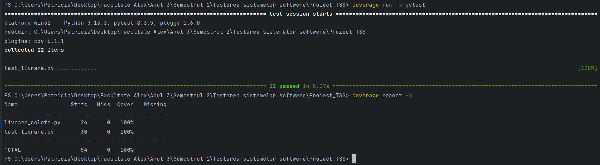
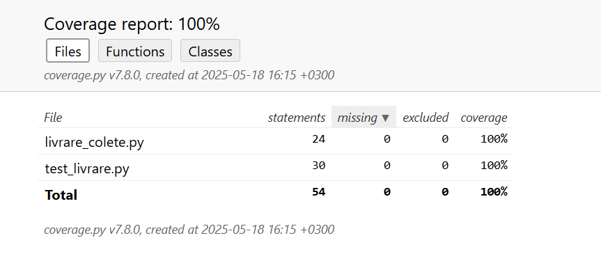
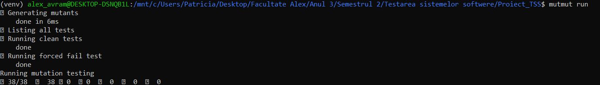

# Testare unitară în Python
## Problema

Scrieți o clasă Livrare care să calculeze costul livrării unui colet în funcție de greutatea coletului, distanța de livrare și opțiunea de livrare expresă, respectând următoarele reguli:

Tariful de bază în funcție de greutate:
- Dacă greutatea coletului este mai mică de 1 kg, tariful este 10 RON.
- Dacă greutatea coletului este între 1 kg și 5 kg (inclusiv), tariful este 20 RON.
- Dacă greutatea coletului este mai mare de 5 kg, tariful este 50 RON.

Costul în funcție de distanța de livrare:
- Pentru o distanță mai mică de 10 km, nu se adaugă niciun cost suplimentar. 
- Pentru o distanță între 10 km și 50 km (inclusiv), se adaugă 5 RON. 
- Pentru o distanță mai mare de 50 km, se adaugă 15 RON.

Livrare expresă:
- Dacă opțiunea de livrare expresă este activată, costul total se mărește cu 25%.

Validarea datelor de intrare:
- Dacă greutatea sau distanța este un număr negativ, programul trebuie să arunce o excepție ValueError cu un mesaj potrivit.

## Structura

```
- livrare_colete.py      # clasa testată
- test_livrare.py        # teste unitare
- README.md              # documentație
```

## 1. Partiționare în clase de echivalență – Clasa `Livrare`

### 1. Domeniul de intrări

Clasa `Livrare` are metoda `calculate()` cu următorii parametri:

- `weight`: greutatea coletului (`float`) – trebuie să fie ≥ 0
- `distance`: distanța de livrare (`float`) – trebuie să fie ≥ 0
- `express`: opțional (`bool`) – dacă livrarea este expresă sau nu

---

#### a) `weight` (greutate colet)

| Clasă | Domeniu                 | Descriere                      |
|-------|-------------------------|--------------------------------|
| W₁    | 0 ≤ weight < 1          | Colet foarte ușor              |
| W₂    | 1 ≤ weight ≤ 5          | Colet mediu                    |
| W₃    | weight > 5              | Colet greu                     |
| W₄    | weight < 0              | Valoare invalidă               |

---

#### b) `distance` (distanță livrare)

| Clasă | Domeniu                 | Descriere                      |
|-------|-------------------------|--------------------------------|
| D₁    | 0 ≤ distance < 10       | Distanță scurtă                |
| D₂    | 10 ≤ distance ≤ 50      | Distanță medie                 |
| D₃    | distance > 50           | Distanță mare                  |
| D₄    | distance < 0            | Valoare invalidă               |

---

#### c) `express` (livrare expresă)

| Clasă | Valoare | Descriere                  |
|-------|---------|----------------------------|
| E₁    | True    | Livrare expresă (+25%)     |
| E₂    | False   | Livrare standard           |

---

### 2. Domeniul de ieșiri

Metoda returnează:

- costul total de livrare (float, rotunjit la 2 zecimale)
- sau o **excepție** (`ValueError`) dacă `weight` sau `distance` este negativ

---

### 3. Clase de echivalență globale

| Clasă   | Descriere                                                          |
|---------|--------------------------------------------------------------------|
| C₁₁₁    | W₁ ∩ D₁ ∩ E₁ – greutate mică, distanță scurtă, livrare expresă     |
| C₁₁₂    | W₁ ∩ D₁ ∩ E₂ – greutate mică, distanță scurtă, livrare standard    |
| C₁₂₁    | W₂ ∩ D₂ ∩ E₁ – greutate medie, distanță medie, livrare expresă     |
| C₁₂₂    | W₂ ∩ D₂ ∩ E₂ – greutate medie, distanță medie, livrare standard    |
| C₁₃₁    | W₃ ∩ D₃ ∩ E₁ – greutate mare, distanță mare, livrare expresă       |
| C₁₃₂    | W₃ ∩ D₃ ∩ E₂ – greutate mare, distanță mare, livrare standard      |
| C₂      | W₄ – greutate invalidă (negativă) → eroare                         |
| C₃      | D₄ – distanță invalidă (negativă) → eroare                         |

---

### 4. Cazuri de test corespunzătoare

| Caz    | Intrări                  | Rezultat așteptat                     |
|--------|--------------------------|---------------------------------------|
| c₁₁₁   | (0.5, 5, True)           | (10 + 0) * 1.25 = 12.5                |
| c₁₁₂   | (0.5, 5, False)          | 10 + 0 = 10                           |
| c₁₂₁   | (3, 30, True)            | (20 + 5) * 1.25 = 31.25               |
| c₁₂₂   | (3, 30, False)           | 20 + 5 = 25                           |
| c₁₃₁   | (6, 60, True)            | (50 + 15) * 1.25 = 81.25              |
| c₁₃₂   | (6, 60, False)           | 50 + 15 = 65                          |
| c₂     | (-1, 10, False)          | Excepție: `ValueError`                |
| c₃     | (3, -5, True)            | Excepție: `ValueError`                |

---

## 2. Analiza Valorilor de Frontieră

Pentru fiecare variabilă de intrare, s-au identificat limitele intervalului valid și s-au creat teste pentru următoarele valori:
- Valoarea minimă permisă  
- Valoarea maximă permisă  
- Valori imediate limitelor (minim + 1, maxim - 1)  
- Valori sub limita minimă și peste limita maximă (valori invalide)


```
pytest -v test_livrare.py 
```



---

## 3. Acoperirea la nivel de cod

## Testare acoperire cod

A fost utilizat `coverage` [3] pentru testarea acoperirii.

```
coverage run -m pytest
coverage report -m
```


```
coverage html
start htmlcov\index.html
```


---

## 4. Mutation Testing

### Comandă rulare:

```
cd "/mnt/c/Users/Patricia/Desktop/Facultate Alex/Anul 3/Semestrul 2/Testarea sistemelor softwere/Proiect_TSS"
source venv/bin/activate
mutmut run
```

### Rezultat:



---

## Referințe

- OpenAI, ChatGPT, https://chatgpt.com/,
- Python Software Foundation. Python Language Reference, version 3.x. Disponibil la: https://docs.python.org/3/
- pytest Development Team. pytest Documentation. Disponibil la: https://docs.pytest.org/en/stable/
- mutmut Authors. mutmut: Mutation Testing for Python. Disponibil la: https://mutmut.readthedocs.io/en/latest/
- Coverage.py Project. Coverage.py Documentation. Disponibil la: https://coverage.readthedocs.io/en/latest/
- Ubuntu Documentation Team. Ubuntu Official Documentation. Disponibil la: https://help.ubuntu.com/


